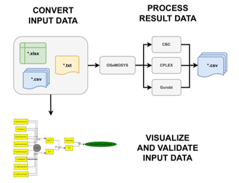

OSeMOSYS Tools for Energy Work, or otoole, is a Python package which provides 
a command-line interface for users of OSeMOSYS. The aim of the package is to 
provide commonly used pre- and post-processing steps when working with OSeMOSYS 
models. Specifically, otoole allows the user to convert between data formats, 
process solutions, and visualise the reference energy system.

otoole existed before I begain contributing to the project in the Fall of 2022. 
This was my first experience learning how to work with community of people 
via GitHub to contribute to a shared project. Moreover, throughout this process
my software development knowledge and Python abilities significantly imporved. In
the spring of 2023 we released the otoole v1.0.0, the first full featured 
reslease.

View the otoole repository [here](https://github.com/OSeMOSYS/otoole)

Read otoole's documentation [here](https://otoole.readthedocs.io/en/latest/index.html)

